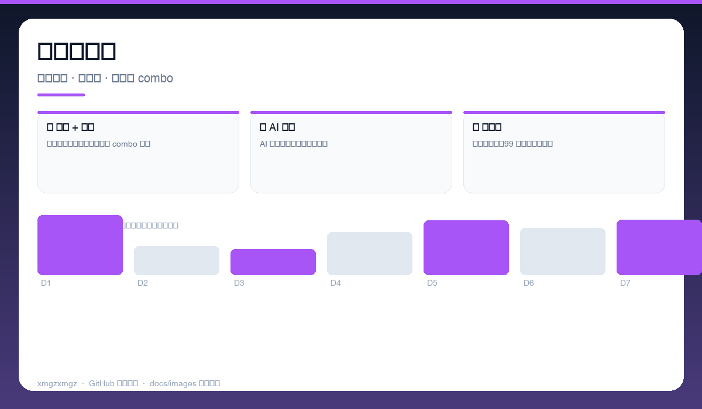
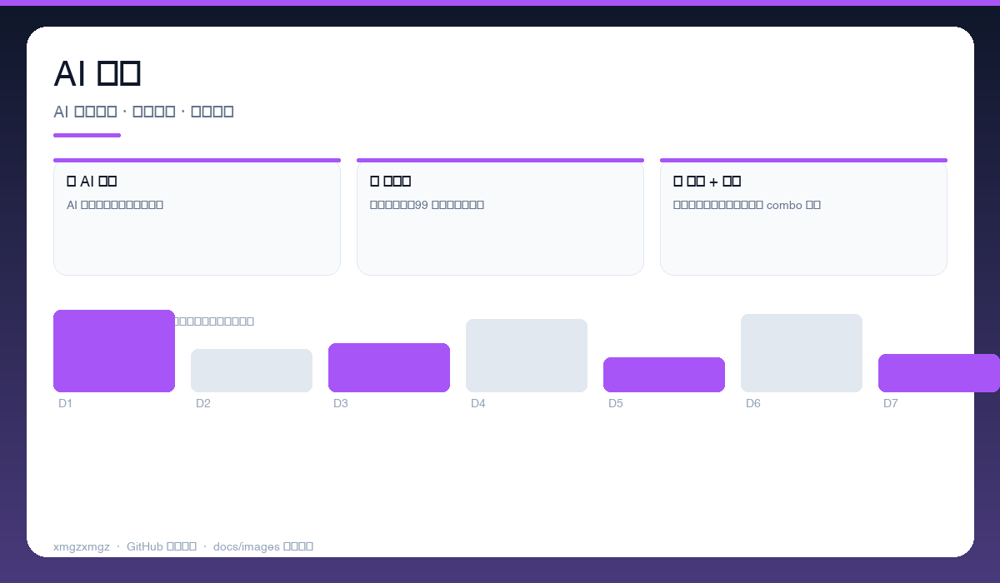
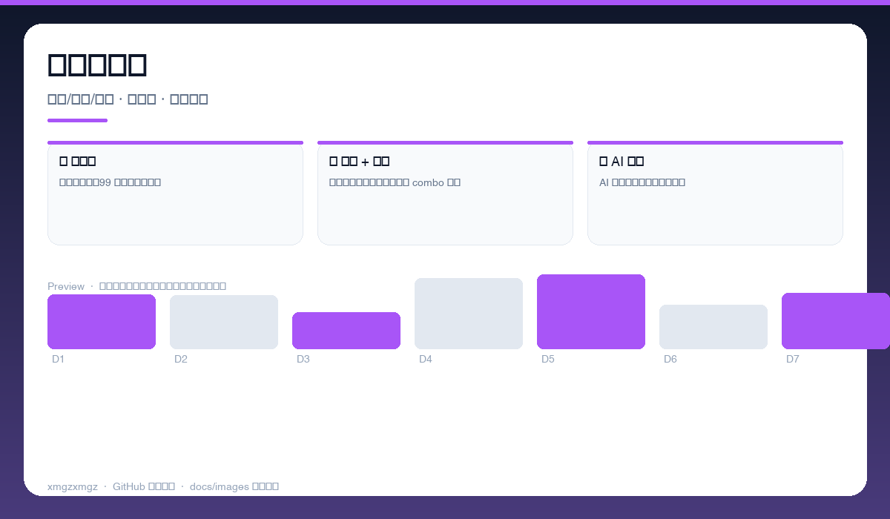

# 🎮 TETRIS-99 — TETRIS-99

> 浏览器里的 99 人大乱斗灵感 — 俄罗斯方块 + 道具 + AI 对战，打开即玩。

[](https://github.com/xmgzxmgz/TETRIS-99)
[](https://github.com/xmgzxmgz/TETRIS-99/releases)
[](LICENSE)
[](https://github.com/xmgzxmgz/TETRIS-99/actions/workflows/release.yml)

---

## ✨ 功能一览

| 模块 | 能力 | 状态 |
|------|------|------|
| 🧱 经典 + 道具 | 经典俄罗斯方块加入道具与 combo 系统 | ✅ |
| 🤖 AI 对战 | AI 自动对战演示与人机对决 | ✅ |
| 🎯 多模式 | 限时、生存、99 人灵感乱斗模式 | ✅ |

---

## 📸 功能预览

> 以下为自动生成的示意预览（无需本地部署截图），展示核心功能形态。

| 总览 | 细节 | 流程 |
|------|------|------|
|  |  |  |
| 游戏主战场 · 方块掉落 · 道具槽 · 分数与 combo | AI 对战 · AI 自动决策 · 对战分屏 · 速度曲线 | 多模式选择 · 经典/限时/乱斗 · 排行榜 · 皮肤切换 |

<details>
<summary>查看大图</summary>


</details>

---

## 🚀 快速开始

```bash
直接打开 index.html
# 在线玩：https://xmgzxmgz.github.io/TETRIS-99/
```

---

## 🛠 技术栈

HTML5 · CSS · JavaScript · Canvas · Game AI

---

## 🗂️ 目录结构（节选）

```
TETRIS-99/
├── docs/images/        # 本 README 的三张自动生成预览图
├── .github/workflows/  # Auto Release 自动发版
├── README.md
└── ...                 # 源码与配置
```

---

## 📦 Releases

本仓库已启用 **Auto Release**（`.github/workflows/release.yml`）：

- 推送 `v*` tag 自动发版：`git tag v0.2.0 && git push origin v0.2.0`
- 手动触发：`gh workflow run "Auto Release" -f version=v0.2.0`（留空则自动 patch +1）
- 变更说明自动生成（`--generate-notes`）

前往 [Releases](https://github.com/xmgzxmgz/TETRIS-99/releases) 查看。

---

## 🙏 相关项目

- [workbuddy-account-hub](https://github.com/xmgzxmgz/workbuddy-account-hub) — WorkBuddy 账户中枢（本 README 的样板）
- 更多见 [xmgzxmgz 主页](https://github.com/xmgzxmgz)

---

## 许可

MIT
